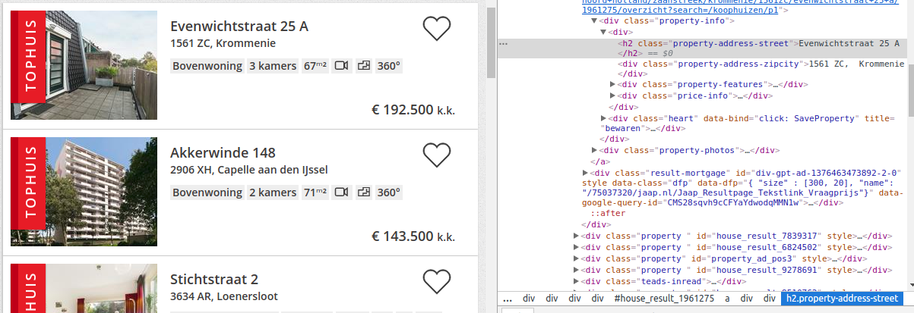

---

```{r, eval=FALSE, include=FALSE}
### libraries die we in de cursus gebruiken
library(stringr)
library(dplyr)
library(tidyverse)
library(ggplot2)
library(wordcloud)
library(wordcloud2)
library(text2vec)
library(pdftools)
library(reticulate)
library(cld2)
library(glmnet)
```

<br>

# Inleiding

---

Deze cursus geeft een inleiding in text mining in R. De volgende punten zullen worden behandeld: 

* String en text basics (stringr manipulaties, word clouds)
* Scraping
* Tokenization, lematization
* Het text2vec package
* Distance measures
* Latent Direchlet Allocation
* Latent semantic indexing
* GLMnet modellen
* Sentiment analyse
* word embeddings (glove)

We gebruiken in deze cursus een aantal data sets die ik eerder al eens gescraped heb. Het betreft: Iens, GTST, Jaap en Ajax, RTL en NOS nieuws.

Er wordt uitgegeaan van en basis kennis van R. Deze cursus bestaat uit twee sessies van ongeveer 3 uur. Er zijn wat begeleidende powerpoint slides.

<br>

# The basics

---


Character data in R kan je bewerken/manipuleren met het `stringr` package. Voordat we daar verder op in gaan is het handig om te weten wat reguliere expressies zijn.

## Reguliere expressies

Dit is een soort 'mini' taaltje om character patronen te specificeren om er vervolgens bijvoorbeeld op te zoeken of filteren. Eerst wat dummy character data.

```{r, eval=FALSE}
test = c("Mijn nummer is 06-12345678", "dit is .. een 1628EP postcode test", "foutje?:  0234XD", "dit is er nog een 1628 EP", "en nog een foute 126EP", "nog een 1234    XX", "1234eZ en nog 4567PK", "12345 Aabcde", "&yfy.")
test
```

Een paar voorbeelden van reguliere expressies.

```{r, eval=FALSE}


## een digit, en precies 1 digit
patroon = "\\d"
str_extract(test, patroon)

## 1 of meerdere digits
patroon = "\\d+"
str_extract(test, patroon)

## precies twee letters
patroon ="[[:alpha:]]{2}"
str_extract(test, patroon)

## Een postcode
patroon = "\\d{4}\\s?[[:alpha:]]{2}"
str_extract(test, patroon)

## Maar een postcode begint niet met een 0
patroon = "[1-9]\\d{3}\\s?[[:alpha:]]{2}"
str_extract(test, patroon)

## special punctuation characters !"#$%&’()*+,-./:;<=>?@[]^_`{|}~
patroon = "[[:punct:]]"
str_extract(test, patroon)
```

Sommige mensen zijn de wildcard notatie gewend om te zoeken in strings, deze wildcard notatie kan je vertalen naar reguliere expressies met `glob2rx`. Een paar voorbeelden zullen hieronder geven. 

```{r, eval=FALSE}
patroon = glob2rx("*23*")
str_extract(test, patroon)
```

Voor een cheatsheet over reguliere expressies zie [regex cheatsheet](https://www.rstudio.com/wp-content/uploads/2016/09/RegExCheatsheet.pdf)

## functies uit het package stringr

In het package stringr zijn diverse functies om met characters te werken, een aantal zullen we laten zien

```{r, eval=FALSE}
testset = titanic::titanic_train %>% select(Name)
## maak extra kolom aan in titanic die namen zoekt
testset = testset %>%
  mutate(
    naamlengte = str_length(Name),
    Ownes = str_detect(Name, 'Owen'),
    Plek = str_locate(testset$Name, "Mr") %>% .[,1],
    Name2 = str_replace(Name, "Mr", "")
  )

str_locate(testset$Name, "Mr")
```

<br>


## Wordclouds

Wordclouds zijn nog steeds een 'mooie' manier om teksten weer te geven. Er zijn twee packages in R die je kan gebruiken voor wordclouds in R, `wordcloud` en `wordcloud2`.

```{r, eval=FALSE}

ajax = readRDS("data/Ajax.Rds")
ajax = ajax %>% mutate_if(is.factor, as.character)

## pak 5 verslagen
verslagjes = paste(
  ajax$Verslag[1:3],
  collapse = " "
)

wordcounts = tibble(w = stringi::stri_extract_all_words(
  str_to_lower(verslagjes)
  ) %>%
  unlist
) %>%
group_by(w) %>%
summarise(n=n())

wordcloud(wordcounts$w, wordcounts$n)
wordcloud2(wordcounts)

```

Er zitten wat woorden in die we weg willen halen

```{r, eval=FALSE}

stopwoorden = c("ajax", "de", "een", "het","en","met","in", "van", "op", "er")

w = stringi::stri_extract_all_words(
      str_to_lower(verslagjes)
    ) %>%
    unlist

w =  w[!w %in% stopwoorden]


wordcounts2 = data.frame(w, stringsAsFactors = FALSE) %>%
group_by(w) %>%
summarise(n=n()) %>% filter (n>2)


wordcloud2(wordcounts2)

```

<br>


## Talen

In deze cursus ligt de focus op de Nederlandse taal. Soms krijg je teksten waar misschien ook andere talen in staan. Je kan dit detecteren met de `detect_language` functie uit het cld2 (Google's compact language detector) package

```{r,eval=FALSE}
# installeer package als het nodig is
#devtools::install_github("ropensci/cld2")

cld2::detect_language("To be or not to be")
cld2::detect_language("ga toch weg, jij rotzak")
cld2::detect_language(url('https://www.rtlnieuws.nl/nederland/maastunnel-twee-jaar-dicht-van-noord-naar-zuid'), plain_text = FALSE)

```


## PDF files

```{r, eval=FALSE}
pdf_text("RestaurantsBlacklist/99.pdf")
```

# Tokenization , part-of-speech tagging en lemmatization

---


```{r, eval=FALSE}
library(udpipe)
dl <- udpipe_download_model(language = "dutch")
dl
```

```{r, eval=FALSE}
udmodel_dutch <- udpipe_load_model(file = "dutch-ud-2.0-170801.udpipe")
x <- udpipe_annotate(udmodel_dutch,  x = "Ik ging op reis en ik nam mee: mijn laptop, mijn zonnebril en goed humeur.")
x <- as.data.frame(x)
x
```

```{r, eval=FALSE}
udmodel_dutch <- udpipe_load_model(file = "dutch-ud-2.0-170801.udpipe")
x <- udpipe_annotate(udmodel_dutch, x = RTLN$bodie[1])
x <- as.data.frame(x)
x

```


# Scraping met het package `rvest`

Met scraping kan je ook veel data en teksten van het web afhalen om te analyseren, we geven een aantal voorbeelden. 

## Basis voorbeelden

In R kan je web sites scrapen met het package `rvest`, dit is een heel handig package. Eerst de basics.

```{r, eval = FALSE}
library(rvest)

## Geef een URL op
baseurl = "http://www.jaap.nl/koophuizen/p1"
out = read_html(baseurl)
   
## out is een zogenaamde xml_document object 
class(out)
```

Met verschillende functies kan je nu een xml_document parsen, bestudeer de site met chrome om een idee te krijgen van de elementen en structuur. Met behulp van CSS of  XPath (XML Path-taal of XML Path Language), een querytaal voor het adresseren van onderdelen van XML-documenten, kan je verschillende elementen uit een xml_document krijgen.

Een kort overzicht vind je <a href="https://msdn.microsoft.com/en-us/library/ms256086(v=vs.110).aspx"> hier </a>. Gebruik dubbel slash `//` om alle elementen in een document te vinden, bijvoorbeeld `//h2` om alle h2 elementen in een docuemnt te pakken. Gebruik `@` om attributen te selecteren.




Neem als voorbeeld de straat van het huis, rechts klik op de straat en klik inspect element, het is een `h2` object met een bepaalde `class` property. Deze kan je dan met Xpath als volgt opgeven:

```{r, eval=FALSE}
## pak als voorbeeld de straat
strout  = html_nodes(out,xpath='//h2[@class="property-address-street"]')

## Er zijn 30 van de straat objecten gevonden in de pagina
length(strout)

## Het is een zogenaamde xml_nodeset
class(strout)
strout

## met de `html_text` functie kan je de tekst er uit halen
straat = strout %>% html_text()
```

Nog een voorbeeldje, de prijs van een huis.

```{r, eval=FALSE}
price =  html_nodes(out, xpath='//div[@class="property-price"]') %>% html_text()

## De prijs is zichtbaar maar het is niet handig om te gebruiken
price
```

Gebruik reguliere expressies om de prijs er uit te pulleken en als bruikbaar numeriek veld te hebben.

```{r, eval=FALSE}
prijs = str_extract(
  price,
  "[:digit:]+[\\.][:digit:]+[\\.]*[:digit:]*"
) %>%
str_replace_all("\\." , "") %>%
  as.numeric()
```

In de huizen data staan ook per huis een link, deze kan je er ook uit halen.


Het is een `a` tag met `class`="property-inner" waarvan je de href moet hebben, dat kan je als volgt met xpath opgeven.

```{r, eval = FALSE}
linkhuis =  html_nodes(out, xpath='//a[@class="property-inner"]/@href') %>% html_text()
linkhuis
```

In een `for` loop zou je al deze links weer kunnen scrapen.


## Verder voorbeelden

```{r, eval = FALSE}
tmp = html_form(read_html("https://hadley.wufoo.com/forms/libraryrequire-quiz/"))
class(tmp)
tmp[[1]]$fields$clickOrEnter$name
```

Zie ook de Environment browser waar je het object `tmp` kan browsen. Soms bevat een html pagina een tabel, deze kan je makkelijk vertalen naar een R data set met `html_table`.

```{r, eval = FALSE}
## op deze pagina staan interessante geboorte statistiken
births <- read_html("https://www.ssa.gov/oact/babynames/numberUSbirths.html")

out = html_nodes(births, "table")

## er zijn twee tabellen op de pagina, de tweede bevat aantal M en F geboortes per jaar
out[[2]] %>% html_table()
```

## Het jaap scrape script

Een compleet script om jaap.nl te scapen zie je [hier](https://github.com/longhowlam/jaap). Switch naar jaap project.

## NOS nieuws site scrapen

Nog een voorbeeld, nieuws archief berichten van de NOS site scrapen. De archieven zijn per dag georganiseerd. Zie bijvoorbeeld de links:

* https://nos.nl/nieuws/archief/2017-10-23/
* https://nos.nl/nieuws/archief/2017-10-22/
* https://nos.nl/nieuws/archief/2017-10-21/
* https://nos.nl/nieuws/archief/2016-10-23/
* etc.

Laten we als voorbeeld de laatste 10 dagen pakken

```{r, eval=FALSE}
OUT = data.frame()

## we kunnen handmatig 1 iteratie uitvoeren om te zien of het werkt
j=1

for(j in 1:10){
  
  ### Maak de juiste URL aan
  datum = as.character(Sys.Date() - j)
  nieuwslinks = paste0("https://nos.nl/nieuws/archief/", datum)
  
  ### Lees de link in
  out = read_html(nieuwslinks)

  ### dit is een nodeset met artikelen, maar daar moeten we de links uit pulleken
  artikels = html_nodes(
    out, 
    xpath = "//a[contains(@href, 'artikel')]"
  )
  
  ## maak een lijst van attributen waarbij je alleen de href genaamde list objecten pakt
  lijst = artikels %>%   html_attrs()
  
  ## gebruik uit purrr map_chr, waarbij je een lijst langs kan gaan en alleen bepaalde elementen kan pakken
  artikels = lijst %>%  map_chr("href") %>%  unique()
  
  artikels = paste0("https://nos.nl", artikels)

  ### loop nu langs alle artiekelen links 
  
  for(i in 1:length(artikels))
  {
    print(i)
    out2 = read_html(artikels[i])
    art = html_nodes(out2, xpath = '//div[@class="article_textwrap"]') %>% html_text %>% paste(collapse = " ")
    titel = html_nodes(out2, xpath = '//h1[@class="article__title"]') %>% html_text()
    datum = html_nodes(out2, xpath = '//time') %>% html_attrs() %>% .[[1]]
    categorie = html_nodes(out2, xpath='//a[@class="link-grey"]') %>% html_text
    tmp = data.frame(datum, titel, art, link = artikels[i], categorie)
    OUT = rbind(OUT,tmp)
  }
  OUT = OUT %>% distinct()
  print(j)
  print(datum)
  saveRDS(OUT, "nosnieuws.RDs")
  Sys.sleep(2*runif(1))
}
```

## SelectorGadget in chrome

Met de selector gadget plugin (in Chrome) kan je elementen selecteren op een web pagina, je krijgt dan de CSS te zien en kan deze gebruiken in de functie `html_nodes`. Een aantal voorbeelden:

### Hema voorbeeldje 

```{r, eval=FALSE}
### HEMA producten
hema = "https://www.hema.nl/winkel/baby/babyspeelgoed"
out = read_html(hema)
speelgoed = html_nodes(out, "h4") %>% html_text()
prijs = html_nodes(out, ".price") %>% html_text()
```

### Mediamarkt voorbeeldje

```{r, eval=FALSE}
### Media Markt laptops, scrape 1 pagina....
MM = "http://www.mediamarkt.nl/nl/category/_laptops-482723.html?searchParams=&sort=&view=PRODUCTLIST&page=3"

out = read_html(MM)

price = html_nodes(out, ".product-wrapper") %>%
  html_nodes(".price-box") %>%
  html_text() %>%
  str_replace_all("\r","") %>%
  str_replace_all("\t","") %>%
  str_replace_all("\n","")

merk = html_nodes(out, ".product-wrapper") %>%
  html_nodes("h2") %>%
  html_text() %>%
  str_replace_all("\r","") %>%
  str_replace_all("\t","") %>%
  str_replace_all("\n","")
```

De `str_replace_all` functie die steeds wordt gebruikt kan je ook weg stoppen in een functie. Ook de prijs kun je nog wat netter maken door naar nuneriek te transformeren.

 
```{r, eval=FALSE}
## functie om wat tabs, newlines en returns weg te halen
cleanstring <- function(x){
  str_replace_all(x,"\r","") %>%
  str_replace_all("\t","") %>%
  str_replace_all("\n","")
}

price = html_nodes(out, ".product-wrapper") %>%
  html_nodes(".price-box") %>%
  html_text() %>%
  cleanstring() %>%
  str_extract("\\d+") %>%
    as.numeric()

merk = html_nodes(out, ".product-wrapper") %>%
  html_nodes("h2") %>%
  html_text() %>%
  cleanstring()

data.frame(price,merk)
```


# Het text2vec package

---


Het werkpaardje voor mij in R voor textmining


## iterators

prepare_fun

## vocabulairs

## term document matrices

## afstanden

## Collocations

# GLMNET

---

Het R package `glmnet` fit regressie modellen met zogenaamde elastic net penalties. In tegenstelling tot gewone regressie waar parameters ongelimiteerd mogen zijn, minimaliseren we in glmnet een loss met penalties, zie onderstaande minimalisatie probleem.


Speciale waarden voor $\alpha$ zijn:

* $\alpha = 1$, lasso regression
* $\alpha = 0$, ridge regression
* $0 < \alpha < 1$, least angle ression


# Termen prijzen in huis beschrijvingen

Een toepassing van GLMNET, ik heb huisbeschrijvingen van de website jaap.nl gescrapet.

```{r, eval=FALSE}
jaap = readRDS("data/jaap.RDs")
```

We gaan eerst wat data opschonen, niet et korte beschrijvingen, te dure en te goedkope huizen er ook halen.

```{r, eval=FALSE}
jaap = jaap %>%
  filter(
    longdescription != ""
  ) %>% 
  mutate(
    Nwoorden = str_count(longdescription, pattern = '[\\w]+'),
    huisbeschrijving = str_to_lower(longdescription)
  )  %>%
  filter(
    prijs > 50000,
    prijs < 1250000,
    Nwoorden > 20,
    Nwoorden < 1500
  )
```


```{r, eval=FALSE}

# create an index column
jaap$id = 1:dim(jaap)[1]


###########  text mining part ##############################

## tokennize

jaap_tokens = jaap$huisbeschrijving %>% word_tokenizer

### use the tokens to create an iterator and vocabular
iter = itoken(
  jaap_tokens, 
  ids = jaap$id,
  progressbar = TRUE
)

## remove some Dutch stopwords
stw = tm::stopwords("nl")

vocab = create_vocabulary(
  iter, 
  stopwords = stw,
  ngram = c(ngram_min = 1L, ngram_max = 3L)
)

pruned_vocab = prune_vocabulary(vocab, doc_proportion_min = 0.0035 )

#### create document term matrix
vectorizer = vocab_vectorizer(pruned_vocab)
dtm = create_dtm(iter, vectorizer)
dim(dtm)

# define tfidf model
tfidf = TfIdf$new()
# fit model to train data and transform train data with fitted model
dtm_tfidf = fit_transform(dtm, tfidf)


########## fit price models ###############

## split into test and train

Ntrain = floor(0.8*nrow(dtm))
tr.idx = sample(1:nrow(dtm), size = Ntrain)

dtm_train = dtm[tr.idx,]
dtm_train_tfidf = dtm_tfidf[tr.idx,]
dim(dtm_train)
dim(dtm_train_tfidf)

dtm_test = dtm[-tr.idx,]
dtm_test_tfidf = dtm_tfidf[-tr.idx,]
dim(dtm_test)

target_train = jaap$prijs[tr.idx]
target_test = jaap$prijs[-tr.idx]


#### glmnet 

glmnet_prijsmodel = cv.glmnet(
  x = dtm_train,
  y = target_train, 
  # L1 penalty
  alpha = 1,
  # high value is less accurate, but has faster training
  thresh = 1e-4,
  # again lower number of iterations for faster training
  maxit = 1e4,
  type.measure="mae"
)

plot(glmnet_prijsmodel)
print(paste("mse =", round(min(glmnet_prijsmodel$cvm), 4)))

### extract terms with 'large' negative or positive value

tmp = coef(glmnet_prijsmodel)
wordvalue = as.numeric(tmp)
names(wordvalue) = tmp@Dimnames[[1]]

### 100 'largest' and 'smallest' terms
neg100 = sort(wordvalue)[1:100]
pos100 = sort(wordvalue, decreasing = TRUE)[1:100]

outterms = tibble::tibble(
  NegWords = names(neg100),
  NegValue = neg100,
  PosWords = names(pos100),
  PosValues = pos100
)

## R squared calculation on the hold out test set
test_huizenprijs = predict(glmnet_prijsmodel, newx = dtm_test)[,1]
R2 = 1 - sum((target_test - test_huizenprijs)^2) / sum((target_test - mean(target_test))^2)
R2

############# xgboost ###################################################################

param = list(
  max_depth = 10,
  nthread = 4
)

xgbmodel = xgboost(
  params = param,
  data = dtm_train,
  label = target_train,
  nrounds = 150,
  print_every_n = 5L
)


## some model diagnostics 
varimp = xgb.importance(colnames(dtm_train), model = xgbmodel)
head(varimp, 25)


xgb.plot.tree(colnames(dtm_train), model = xgbmodel, n_first_tree = 3)

p = xgb.plot.multi.trees(
  model = xgbmodel,
  feature_names = colnames(dtm_train),
  features_keep = 30
)
print(p)


## R squared calculation on the hold out test set
test_huizenprijs = predict(xgbmodel, newdata =  dtm_test)
R2 = 1 - sum((target_test - test_huizenprijs)^2) / sum((target_test - mean(target_test))^2)
R2
```


# Sentiment prediction

---

Ik maak onderscheid tussen voorgedefineerd sentiment met woorden lijsten, en voorspelling aan de hand van training data. 

## Nederlands voor gedefinieerd

Voor Nederlands kan je sentiment bepalen via het Python package pattern.nl (python 2.7 alleen), dit kan je in R aanroepen via reticulate

```{r, eval=FALSE}
library(reticulate)
pattern = import("pattern.nl") 
pattern$sentiment("Ik heb deze laptop gekocht wat een vreselijk slecht apparaat")

pattern$sentiment("Ik heb deze laptop gekocht. Vreselijk goed ding")
pattern$sentiment("Ik heb deze laptop gekocht, niet eens zo slecht")
```


## training sentiment

Voor het trainen van sentiment heb je gelabelde data nodig. per document heb je een score of POS/NEG label nodig. Ik gebruik hier als voorbeeld de IENS revies die ik een tijdje geleden heb gescrapet. Per review heb je ook een cijfer die de reviewer heeft gegeven. Deze gebruik ik als target.


```{r, eval=FALSE}
Iens = readRDS("data/IensReviews.rds")
```

Als eerste controleren op taal en voor deze analyse pakken we alleen de NL reviews.

```{r, eval=FALSE}
talen = detect_language(Iens$Review)
table(talen)
```


Doe glmnet direct op dtm

```{r, eval=FALSE}

```


De term document matrix is ontzetten sparse, om deze wat compacter te maken, zonder veel informatie verlies kunnen we een SVD trick toe passen.


Doe een svd en daarna een predictive model


Als voorbeeldje kan je ook eens kijken naar mijn zzontje :-)   plaatje SVD..... uit mijn slide


```{r, eval=FALSE}
## enkele texten evatten wat rare characters
Sys.setlocale('LC_ALL','C')

it  = itoken(Iens$Review)
voc = create_vocabulary(it) %>% 
  prune_vocabulary(
    doc_proportion_max = 0.1,
    term_count_min = 5
  )

vectorizer = vocab_vectorizer(voc)
dtm = create_dtm(it, vectorizer)
dim(dtm)
```

De dtm is een vrij grote sparse matrix met veel nullen

```{r, eval = FALSE}
sum(dtm > 0) / (1.0*dim(dtm)[1]*dim(dtm)[2])
```

Pas de SVD toe en neem nu 50 dimensies

```{r, eval = FALSE}

tfidf = TfIdf$new()
lsa = LSA$new(n_topics = 50)

# pipe friendly transformation
doc_embeddings = dtm %>% 
  fit_transform(tfidf) %>% 
  fit_transform(lsa)

dim(doc_embeddings)
doc_embeddings[1:25,]
```


# Glove word embeddings

---

Een word embedding is een rij getallen die een woord representeert. Deze rij getallen / vectoren worden getrained uit een corpus. Zie bijvoorbeeld [de site van het text2vec package](http://text2vec.org/glove.html)


In een traditionele term document matrix zijn de volgende twee documenten vrij ongerelateerd

* De president spreekt met de media
* Trump praat tegen de pers

maar uit een grotere set documenten zou je kunnen leren dat De president en Trump gerelateerd zijn en dat geld ook voor de media en de pers.

We gaan word embeddings leren op een grote verzameling van RTL Nieuws artikelen

EMBED SCRIPT

Check mijn shiny app

http://145.131.21.163:3838/sample-apps/wordembeddings/

en code op mijn github


<br>


# Latente Dirichlet Allocatie

---

Hoe kan je nou een beeld krijgen van veel documenten zonder deze allemaal zelf te lezen? Een manier is een Latente Dirichlet Allocatie (LDA) model fitten op de documenten. Met deze techniek kan je een groot aantal documenten indelen in een kleiner aantal topics. Elk topic kenmerkt zich door een aantal woorden, waarvan sommige belangrijker dan anderen.

Het LDA model is een generatief model, het gaat er van uit dat documenten volgens een bepaald stramien worden gegenereerd. Heel in het kort:

Kies een kans mixture van (zeg even 3) topics, bijvoorbeeld 1/4 Topic A, 1/4 Topic B en 1/2 Topic C. Elk topic heeft weer een kansverdeling van woorden, bijvoorbeeld:

Topic A 30% ministerie, 20% politie, 50% veiligheid
Topic B 25% buitenhof, 25% Den haag, 10% kamer, 40% politiek
Topic C 15% inenten, 30% bijbel 30% tegen 25% geloof

Een document wordt dan als volgt gegenereerd: Kies met bovenstaande kansen de topics, en dan per gekozen topic kies een aantal woorden volgens de woorden kansverdeling van het desbetreffende topic.

Van te voren kennen we deze kansverdelingen niet, maar gegeven een aantal documenten proberen we deze kans verdelingen te achterhalen. Dit is het trainen/fitten van een LDA model.

In R kan je met het `text2vec` package ook LDA modellen trainen. We zullen hier de GTST data set gebruiken. Dit zijn 4090 samenvattingen van GTST afleveringen van 1-okober-1990 tot en met 31-05-2012.

```{r, eval=FALSE}
GTST = readRDS("data/GTST_samenvattingen.RDs")
```

Laten we een topic model maken met 15 topics


```{r, eval=FALSE}
GTST$id = 1:dim(GTST)[1]
tokens = GTST$text_of_1month %>% 
  tolower %>% 
  word_tokenizer

# stopwoorden er uit. Ik heb een lijstje die ik nog aanvul 
stopwoorden = c(
  readRDS("data/stopwoorden.RDs"),
  letters)

it  = itoken(tokens, ids = GTST$id, progressbar = FALSE)
voc = create_vocabulary(it, stopwords = stopwoorden) %>% 
  prune_vocabulary(
    term_count_min = 5
  )

vectorizer = vocab_vectorizer(voc)
dtm = create_dtm(it, vectorizer)
dim(dtm)

lda_model = LDA$new(
  n_topics = 15,
  doc_topic_prior = 0.1,
  topic_word_prior = 0.01
)

doc_topic_distr =  lda_model$fit_transform(
  x = dtm,
  n_iter = 1000, 
  convergence_tol = 0.001, 
  n_check_convergence = 25, 
  progressbar = FALSE
)
```

Wat zit er in output object? Het is een verdeling van topics over alle documenten. Voor document 1 hebben we de volgende topic verdeling

```{r, eval=FALSE}
dim(doc_topic_distr)

barplot(doc_topic_distr[1, ], xlab = "topic", 
        ylab = "proportion", ylim = c(0, 1), 
        names.arg = 1:ncol(doc_topic_distr))
```

Het `lda_model` object bevat nu ook de woorden die bij de topics horen

```{r, eval=FALSE}
lda_model$get_top_words(n = 20,  lambda = 1)
```

Plot of topics in twee dimensionale ruimte met behulp van het `LDAvis` package

```{r, eval=FALSE}
lda_model$plot()
```

### Scoren van nieuwe documenten

Als je een LDA model hebt gemaakt kan je deze gebruiken om nieuwe documenten te scoren en zo van deze documenten de meest waarschijnlijke topic bepalen.

```{r, eval=FALSE}
## pak nu als test gewoon weer wat GTST afleveringen, zeg eveb de eerste 10

TEST = GTST[1:10,]

new_dtm = itoken(
  TEST$text_of_1month, 
  tolower, 
  word_tokenizer, 
  ids = TEST$id
) %>% 
create_dtm(vectorizer)

dim(new_dtm)

new_doc_topic_distr = lda_model$transform(new_dtm)
```

De matrix new_doc_distr bevat per doument de kans op een topic, hoe kan je per document de meest waarschijnlijek topic halen?

```{r, eval=FALSE}
## kijk eens naar een document, zeg 6
new_doc_topic_distr[6,]
which.max(new_doc_topic_distr[6,])

## gebruik purrr om een functie toe te passen op rijen van een matrix
rows <- function(m){ map(seq_len(nrow(m)), ~m[.,] ) }
purrr::map_int(rows(new_doc_topic_distr), which.max)

```

